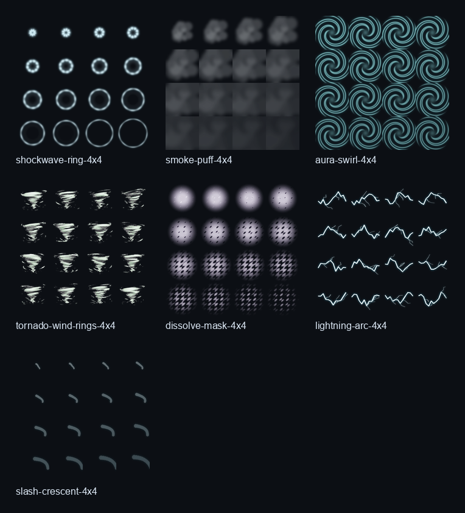

# Flipbook Textures

PlumeFX includes seven original 4x4 PNG flipbook sheets in `media/flipbooks`:

- `plumefx-shockwave-ring-4x4.png`
- `plumefx-smoke-puff-4x4.png`
- `plumefx-aura-swirl-4x4.png`
- `plumefx-tornado-wind-rings-4x4.png`
- `plumefx-dissolve-mask-4x4.png`
- `plumefx-lightning-arc-4x4.png`
- `plumefx-slash-crescent-4x4.png`

Preview:



## Upload Workflow

Roblox `ParticleEmitter.Texture` needs an uploaded Roblox image asset id.

1. Upload each PNG from `media/flipbooks` to Roblox as an image asset.
2. Copy the resulting `rbxassetid://...` values.
3. Paste them into `ReplicatedStorage.Plume.Presets.Textures` under `Textures.flipbooks`.
4. Use those ids in `renderSprite({ texture = ..., flipbook = ... })`.

## Where To Get Image IDs

In Roblox Studio:

1. Open **Window > Asset Manager**.
2. Go to **Images** or use the import button to import the PNGs from `media/flipbooks`.
3. Wait for Roblox moderation/import to finish.
4. Right-click each uploaded image.
5. Click **Copy Asset ID** or **Copy ID to Clipboard**.
6. Paste it into `Textures.flipbooks` as `rbxassetid://COPIED_ID`.

Example:

```lua
Textures.flipbooks = {
	shockwave = "rbxassetid://1234567890",
	smokePuff = "rbxassetid://1234567891",
	auraSwirl = "rbxassetid://1234567892",
	tornadoWind = "rbxassetid://1234567893",
	dissolveMask = "rbxassetid://1234567894",
	lightningArc = "rbxassetid://1234567895",
	slashCrescent = "rbxassetid://1234567896",
}
```

You can also click **View in Browser** from the Asset Manager. The number in the asset page URL is the same ID.

Example:

```lua
local textureId = "rbxassetid://YOUR_UPLOADED_SHOCKWAVE_ID"

local effect = Plume.system("MyFlipbookShockwave")
	:duration(0.8)
	:emitter("shockwave", function(e)
		return e:spawnBurst({ time = 0, count = 1 })
			:lifetime(0.72)
			:position({ shape = { kind = "point" } })
			:size(5)
			:color(Color3.new(0.72, 0.94, 1), { alpha = 0.85 })
			:alphaOverLife({
				{ 0, 0 },
				{ 0.12, 1 },
				{ 1, 0 },
			})
			:renderSprite({
				texture = textureId,
				flipbook = {
					layout = "Grid4x4",
					mode = "OneShot",
					framerate = 28,
					startRandom = false,
					blendFrames = true,
				},
				blending = "additive",
				brightness = 2.4,
				lightEmission = 1,
			})
	end)
	:build()
```

`flipbook-shockwave` and `flipbook-dissolve-impact` are registered demo presets. They appear in the PlumeFX test panel, and they start using the real flipbook animation as soon as the uploaded texture ids are pasted into `Textures.flipbooks`. `whirling-tornado` uses the same uploaded texture path for the tornado wind sheet.

`ReplicatedStorage.Plume.Examples.FlipbookShowcase` includes ready-to-copy systems for a shockwave and a dissolve impact. The tornado flipbook usage lives in `ReplicatedStorage.Plume.Presets.Atmosphere` as the production `whirling-tornado` preset.

For AI-generated flipbook art, use a flat magenta or chroma-key green background, then remove it with Pillow before upload. The final Roblox upload should be a PNG with real alpha, not a keyed background.
